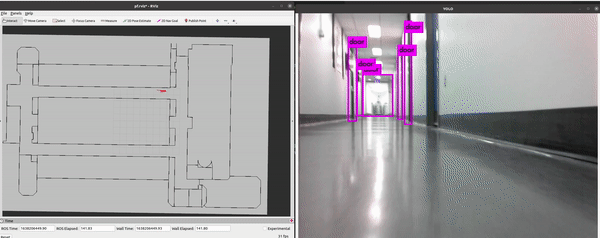

# Real-Time Indoor Landmark Detection

## Overview

This is the **Indoor Landmark Detection** module for F1tenth racecar navigation which heavily adapted from [YOLO: Real-Time Object Detection](http://pjreddie.com/darknet/yolo/).

The trained YOLO model can classify indoor objects(currently doors only but can be generalized to more classes with more labeled data), and has an overall accuracy(validation) > 95%. With the tiny sized model, the detection frame rate can reach >15 fps onboard.

## Fine Tuning
Pre-trained YOLO models are trained using datasets taken from human's perspective and outdoors, such as COCO. However in our case, the landmarks to be detected are indoor architectural objects, such as doors, windows, floors, chairs and tables, etc. Thus, we need to fine tuning some pretrained YOLO model with customized dataset to achieve high accuracy. This [jupyter notebook](https://colab.research.google.com/drive/17xMqGVzHqhNtDBl2TepkhG_1YKyp9wmQ?usp=sharing) is written for fine tuning and you may find this [blog](https://eng-memo.info/blog/yolo-original-dataset-en/) also very useful.

## Installation

### Dependencies

This software is built on the Robotic Operating System ([ROS]), which needs to be [installed](http://wiki.ros.org) first. Additionally, YOLO for ROS depends on following software:

- [OpenCV](http://opencv.org/) (computer vision library),
- [boost](http://www.boost.org/) (c++ library),

### Building

In order to install darknet_ros, clone the latest version using SSH (see [how to set up an SSH key](https://confluence.atlassian.com/bitbucket/set-up-an-ssh-key-728138079.html)) from this repository into your catkin workspace and compile the package using ROS.

    cd catkin_workspace/src
    git clone --recursive git@github.com:leggedrobotics/darknet_ros.git
    cd ../

To maximize performance, make sure to build in *Release* mode. You can specify the build type by setting

    catkin_make -DCMAKE_BUILD_TYPE=Release

or using the [Catkin Command Line Tools](http://catkin-tools.readthedocs.io/en/latest/index.html#)

    catkin build darknet_ros -DCMAKE_BUILD_TYPE=Release

Darknet on the CPU is fast (approximately 1.5 seconds on an Intel Core i7-6700HQ CPU @ 2.60GHz × 8) but it's like 500 times faster on GPU! You'll have to have an Nvidia GPU and you'll have to install CUDA. The CMakeLists.txt file automatically detects if you have CUDA installed or not. CUDA is a parallel computing platform and application programming interface (API) model created by Nvidia. If you do not have CUDA on your System the build process will switch to the CPU version of YOLO. If you are compiling with CUDA, you might receive the following build error:

    nvcc fatal : Unsupported gpu architecture 'compute_61'.

This means that you need to check the compute capability (version) of your GPU. You can find a list of supported GPUs in CUDA here: [CUDA - WIKIPEDIA](https://en.wikipedia.org/wiki/CUDA#Supported_GPUs). Simply find the compute capability of your GPU and add it into darknet_ros/CMakeLists.txt. Simply add a similar line like

    -O3 -gencode arch=compute_62,code=sm_62

### Customize detection objects

Download the fine-tuned [weights](https://drive.google.com/file/d/18OIE-rE096ekzOGO3TAP2lR8XmVo-lTX/view?usp=sharing) and copy it under directory:

    catkin_workspace/src/darknet_ros/darknet_ros/yolo_network_config/weights/

The model configure is defined in

    catkin_workspace/src/darknet_ros/darknet_ros/yolo_network_config/cfg/yolov3-tiny-door-detection.cfg

In addition, the [config file](darknet_ros/config/yolov3-door-detection.yaml) for ROS defines the names of the detection objects, in our case is "door" only.

### Unit Tests

Run the unit tests using the [Catkin Command Line Tools](http://catkin-tools.readthedocs.io/en/latest/index.html#)

    catkin build darknet_ros --no-deps --verbose --catkin-make-args run_tests

You will see the image above popping up.

## Basic Usage

In order to get YOLO ROS: Real-Time Object Detection for ROS to run with your robot, you will need to adapt a few parameters. It is the easiest if duplicate and adapt all the parameter files that you need to change from the `darknet_ros` package. These are specifically the parameter files in `config` and the launch file from the `launch` folder.

## Nodes

### Node: darknet_ros

This is the main YOLO ROS: Real-Time Object Detection for ROS node. It uses the camera measurements to detect pre-learned objects in the frames.

### ROS related parameters

You can change the names and other parameters of the publishers, subscribers and actions inside `darknet_ros/config/ros.yaml`.

#### Subscribed Topics

* **`/camera_reading`** ([sensor_msgs/Image])

    The camera measurements.

#### Published Topics

* **`object_detector`** ([std_msgs::Int8])

    Publishes the number of detected objects.

* **`bounding_boxes`** ([darknet_ros_msgs::BoundingBoxes])

    Publishes an array of bounding boxes that gives information of the position and size of the bounding box in pixel coordinates.

* **`detection_image`** ([sensor_msgs::Image])

    Publishes an image of the detection image including the bounding boxes.

#### Actions

* **`camera_reading`** ([sensor_msgs::Image])

    Sends an action with an image and the result is an array of bounding boxes.

### Detection related parameters

You can change the parameters that are related to the detection by adding a new config file that looks similar to `darknet_ros/config/yolo.yaml`.

* **`image_view/enable_opencv`** (bool)

    Enable or disable the open cv view of the detection image including the bounding boxes.

* **`image_view/wait_key_delay`** (int)

    Wait key delay in ms of the open cv window.

* **`yolo_model/config_file/name`** (string)

    Name of the cfg file of the network that is used for detection. The code searches for this name inside `darknet_ros/yolo_network_config/cfg/`.

* **`yolo_model/weight_file/name`** (string)

    Name of the weights file of the network that is used for detection. The code searches for this name inside `darknet_ros/yolo_network_config/weights/`.

* **`yolo_model/threshold/value`** (float)

    Threshold of the detection algorithm. It is defined between 0 and 1.

* **`yolo_model/detection_classes/names`** (array of strings)

    Detection names of the network used by the cfg and weights file inside `darknet_ros/yolo_network_config/`.
